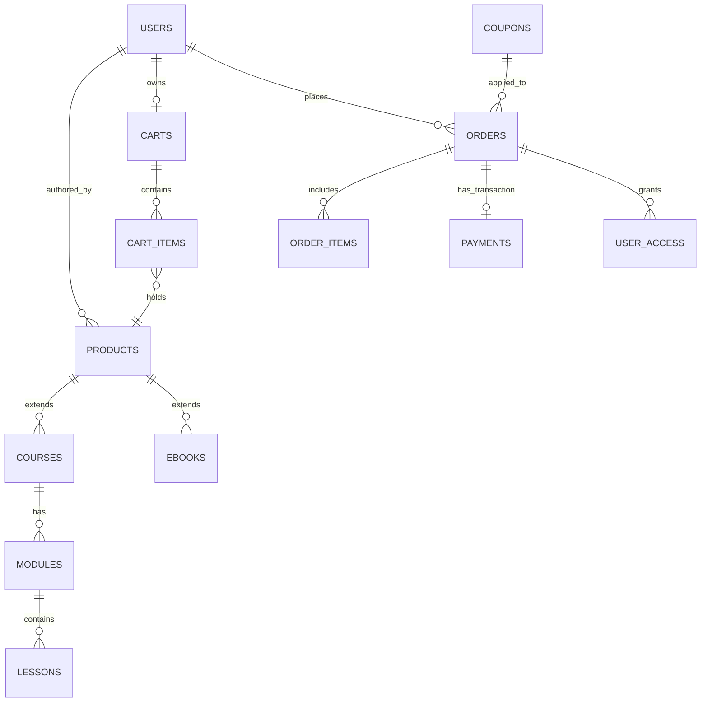

# BÁO CÁO BÀI TẬP LỚN (BUỔI 1)
## XÂY DỰNG HỆ THỐNG THƯƠNG MẠI ĐIỆN TỬ PHÂN PHỐI HỌC LIỆU SỐ (ELearnVN)

---

### I. GIỚI THIỆU CHUNG VÀ LỰA CHỌN CHỨC NĂNG CỐT LÕI

Hệ thống ELearnVN không phải là nền tảng thương mại điện tử hàng hóa vật lý thông thường mà là hệ thống phân phối **nội dung số** (Khóa học Video, Ebook). Do đó, luồng xử lý dữ liệu và kinh doanh (Business Logic) phức tạp hơn rất nhiều, đòi hỏi quản lý phân cấp nội dung và kiểm soát quyền truy cập kỹ lưỡng. Dự án tập trung vào 2 chức năng lõi đại diện cho hai vai trò chính:

#### 1. Chức năng 1 (Dành cho Admin/Giảng viên): Quản trị Sản phẩm Số Phân Cấp
- **Đặc thù kỹ thuật:** Sử dụng cấu trúc quan hệ kế thừa (Polymorphism-like) trong cơ sở dữ liệu. Bảng `products` lưu trữ thông tin chung (giá, tên, ảnh bìa), được mở rộng bởi bảng `courses` (lưu level, thời lượng) hoặc `ebooks` (lưu dung lượng, định dạng file PDF/EPub).
- **Logic Quản trị Content:** Khóa học được thiết kế phân cấp 3 lớp: `Course` (Khóa học) -> có nhiều `Modules` (Chương) -> mỗi Chương có nhiều `Lessons` (Bài học). 
- **Kết nối Video Streaming:** Bài học lưu trữ tham chiếu đến định danh video của nền tảng Mux (`mux_playback_id`) để sau khi người dùng mua thành công có thể trực tiếp stream video.

#### 2. Chức năng 2 (Dành cho User/Học viên): Luồng Mua Sắm, Giỏ Hàng & Thanh Toán VNPay
- **Logic Giỏ hàng (`carts`):** Quản lý trạng thái giỏ hàng. Đặc biệt quan trọng: Hệ thống phải kiểm tra realtime xem người dùng **đã sở hữu khóa học này chưa** (bản ghi trong `user_access`) trước khi cho phép thêm vào giỏ hàng (`POST /api/cart`).
- **Xử lý Mã giảm giá (`coupons`):** Thuật toán tính toán hóa đơn linh hoạt (`_compute_discount`), hỗ trợ giảm tiền mặt (`fixed`) hoặc giảm theo phần trăm (`percent`), đồng thời xét theo điều kiện ngặt nghèo (Hạn sử dụng, Đơn hàng tối thiểu `min_order_amount`, Lượt sử dụng tổi đa `usage_limit`).
- **Luồng Order & Thanh toán (VNPay):** Từ giỏ hàng, hệ thống sinh ra bản ghi `orders` (trạng thái pending) và dẫn người dùng qua cổng thanh toán VNPay bằng chữ ký mã hóa Hash HMAC SHA512.
- **Tự động Cấp/Thu hồi Quyền Truy Cập:** Nhận Callback (IPN) từ VNPay để chuyển trạng thái Order thành `paid` và ngay lập tức sinh bản ghi trong `user_access` để "mở khóa" video/ebook. Thêm vào đó, chức năng "Hoàn tiền" (Refund) được lập trình giới hạn nghiêm ngặt: chỉ cho phép hoàn khi khóa học chưa học quá 10%, Ebook chưa từng được mở ra xem, và chưa quá 3 ngày.

---

### II. TRIỂN KHAI MÔI TRƯỜNG & QUY TẮC LÀM VIỆC NHÓM

#### 1. Quy tắc Git Flow & Quy trình Review
- Kho lưu trữ (Repository) thiết lập trên GitHub. Cấu trúc chia làm 2 nhánh cốt lõi: 
  - `main`: Nhánh production, chứa mã nguồn đã nghiệm thu, tuyệt đối không commit trực tiếp.
  - `develop`: Nhánh tích hợp thường xuyên của team.
- **Tiêu chuẩn Commit:** Tuân thủ Conventional Commits format: `<type>(<scope>): <subject>` (Ví dụ: `feat(api): thêm tính năng thanh toán VNPay`).
- **Quy trình Merging:** Tất cả các tính năng mới được tạo nhánh từ `develop` (theo format `feature/...`). Khi hoàn thành phải tạo Pull Request (PR) đính kèm mô tả và cần ít nhất 1 thành viên Approve nhận xét trước khi Merge.

#### 2. Cài đặt Môi trường Backend (API-First Architecture)
- **Framework & Ngôn ngữ:** Xây dựng hoàn toàn bằng **Python 3.10+** và **FastAPI** – một framework tạo REST API bất đồng bộ (Asynchronous) cho tốc độ xử lý nghiệp vụ I/O siêu việt.
- **Dependencies Management:** Khai báo rõ ràng tại `requirements.txt`. Chạy trong môi trường ảo (`venv`).
- **Cấu trúc Tổ chức Code Clean Architecture:** 
  - `routers/`: Định tuyến các Endpoints (Controller).
  - `models/`: Chứa các SQLAlchemy ORM Model ánh xạ với CSDL.
  - `schemas/`: Chứa các Pydantic Model để kiểm tra & xác thực dữ liệu đầu vào (Input Validation).
- **Hỗ trợ Triển khai nhanh:** Toàn bộ stack được đóng gói bằng **Docker & Docker Compose** giúp chạy Database, Web server và Reverse Proxy (Nginx) bằng một lệnh duy nhất.

---

### III. THIẾT KẾ CƠ SỞ DỮ LIỆU ĐÁP ỨNG CHỨC NĂNG
Lược đồ (ERD) được chuẩn hóa bằng chuẩn InnoDB trên MySQL với Encoding utf8mb4. Tất cả bảng được ràng buộc khóa ngoại cứng (Foreign Key Constraint) với hiệu ứng `ON DELETE CASCADE`. (Cấu trúc chi tiết tại `database/init.sql`). Dưới đây là các bảng liên quan đến 2 chức năng lõi:

1. **Quản lý Sản phẩm số:** Bảng `products` -> `courses`, `ebooks`. Từ `courses` nối bảng `modules` và `lessons` (Lưu thông số `mux_playback_id`).
2. **Mua sắm:** 
   - `carts`, `cart_items` (Giỏ hàng tạm, liên kết trực tiếp để định giá realtime).
   - `orders`, `order_items`. Bảng `orders` sở hữu khóa ngoại nối đến `coupons` (Mã giảm giá).
   - `payments`: Ánh xạ 1-1 với `orders`, chứa cổng `method` (vnpay), `transaction_id`.
   - `user_access`: Bảng đặc biệt sinh ra sau khi thanh toán, theo dõi thời gian truy cập số (`granted_at`, `revoked_at`).

---

### IV. CHI TIẾT CÁC ENDPOINT API SERVER TRỊNH DUYỆT (REST API)

Dự án áp dụng mô hình Dependency Injection (`Depends`) của FastAPI cho phân quyền Auth. Cụ thể:
- Xác thực Stateless JWT Token với bcrypt Hash (các file `auth.py`, `core/security.py`).
- Viết sẵn Guard Middleware `get_current_user` và `require_admin` ép quyền thao tác.

#### 1. Luồng 1 (Admin): Quản trị Môn Học (File `admin.py`)
- `POST /api/admin/products`: Nhận payload khởi tạo sản phẩm, tách logic Transaction chèn vào bảng `products`, sau đó chèn vào `courses` hoặc `ebooks` dựa theo giá trị thẻ `product_type`.
- `POST /api/admin/courses/{id}/modules` & `POST /api/admin/modules/{id}/lessons`: Đắp thêm chương, bài học vào khóa học. API sẽ tính toán lại `total_lessons` tự động lưu vào khóa học.

#### 2. Luồng 2 (User): Đặt hàng, Khuyến mãi & Thanh toán VNPay (File `cart.py`, `orders.py`, `payment.py`)
- `POST /api/cart`: Hàm `add_to_cart` truy xuất `UserAccess` xem đã bỏ tiền mua chưa. Nếu mua rồi API trả về `ConflictException` (409) chặn gian lận mua lặp.
- `POST /api/orders/validate-coupon`: Tính `subtotal` giỏ hàng. Rẽ nhánh logic xem Coupon là `percent` hay `fixed`, có đạt `min_order_amount` hay không.
- `POST /api/orders`: Xử lý chốt giỏ hàng. Dùng Transaction SQLAlchemy đổ vào bảng `orders`, trừ quota của `coupons`, xóa trắng bảng `cart_items` sau đó trả về ID hóa đơn.
- **Thanh toán:** Khi Request vào `POST /api/payment/create/{order_id}`, Server sẽ tính toán chữ ký VNPAY Hash SHA512, sinh đường dẫn URL Gateway và trả về Frontend redirect user. Endpoint Webhook xử lý trả về giúp Server biết giao dịch thành công để cập nhật bảng `user_access` thành `is_active=True`.

---

### V. KẾT QUẢ TRIỂN KHAI VÀ HƯỚNG DẪN KIỂM THỬ THỦ CÔNG

- **Dữ liệu mồi (Seed Data):** Cơ chế khởi động Server được nhúng script `init_data.py`. Tự động chèn 4 khóa học, 3 Ebook, 3 User đại diện (`admin@elearning.vn`, `author@...`, `user@...`), và các mã Test Coupon như `WELCOME50`.
- **Kiểm thử hệ thống API Docs (Mô tả kèm ảnh minh họa):** 
  Toàn bộ giao tiếp Server được UI hóa trực quan thông qua công nghệ Swagger tự sinh của FastAPI. Ta có thể test toàn bộ chu trình 2 chức năng trên bằng việc lên trình duyệt mở: `http://localhost:8000/docs`.

**(Sinh viên đính kèm thêm Hình ảnh theo thứ tự bên dưới để hoàn thiện Báo cáo):**

1. *(Hình 1: Đăng nhập với luồng OAuth / Form Login lấy chuỗi Token Bearer hiển thị trên Swagger UI).*
2. *(Hình 2: Admin thêm một khóa học mới qua endpoint `POST /api/admin/products` kèm dữ liệu test thành công trả về JSON 200 OK).*
3. *(Hình 3: User gọi endpoint Giỏ hàng, Áp mã `WELCOME50` hiện số tiền trừ đi thành công, và gọi endpoint Tạo Order ra mã đơn).*
4. *(Hình 4: URL chuyển hướng ra trang nhập thông tin thẻ Test của VNPAY Sandbox).*
5. *(Hình 5: Hình ảnh Database bảng `user_access` hoặc ứng dụng hiển thị trạng thái "Đã mua" sau khi IPN trả dữ liệu).*

---

### VI. BỔ SUNG ĐỢT HOÀN THIỆN (schema / IPN / coupon / Git)

- **CSDL:** `database/init.sql` bổ sung cột `user_access.accessed_at` (đồng bộ ORM — điều kiện hoàn tiền ebook). File `alter.sql` và `backend/local_migration.py` hỗ trợ nâng cấp DB đã triển khai trước đó.
- **VNPay IPN:** Endpoint `GET|POST /api/payment/vnpay-ipn` — xác thực chữ ký, gọi chung `process_vnpay_return` (idempotent khi đơn đã `paid`). Biến môi trường `VNPAY_IPN_URL` (URL công khai, ví dụ ngrok) được gửi kèm tham số `vnp_IpnUrl` khi tạo URL thanh toán nếu biến được cấu hình. Phản hồi JSON `RspCode`/`Message` theo chuẩn xác nhận IPN.
- **Coupon khi tạo đơn:** `POST /api/orders` bắt buộc mã hợp lệ nếu gửi `coupon_code` (không âm thầm bỏ qua); dùng chung `_assert_coupon_eligible` với luồng validate.
- **GitHub:** https://github.com/nmdung3114/ecommerce-learning-platform — nhánh `develop` đã có trên remote; quy trình nhóm: [CONTRIBUTING.md](CONTRIBUTING.md).
- **Log kiểm tra tự động cục bộ:** xem file `BTL_VERIFICATION_LOG.txt` (ảnh chụp Swagger/Postman/ghi DB bổ sung vào báo cáo theo mục V ở trên).
